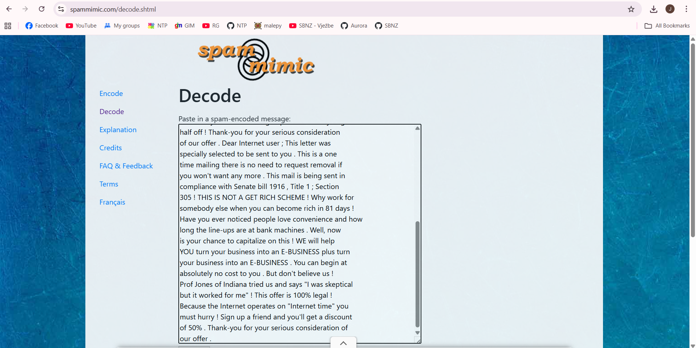
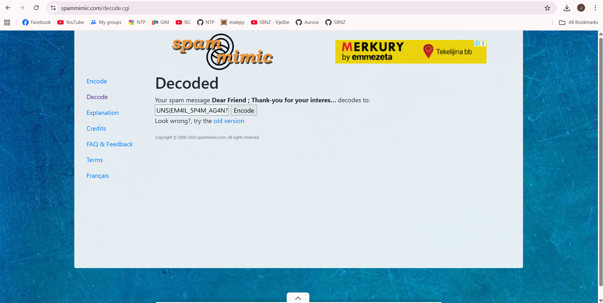
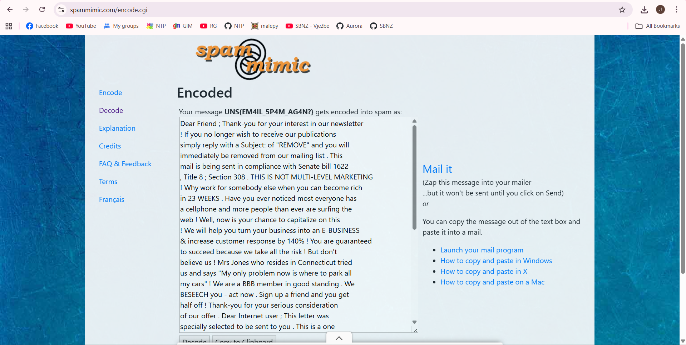
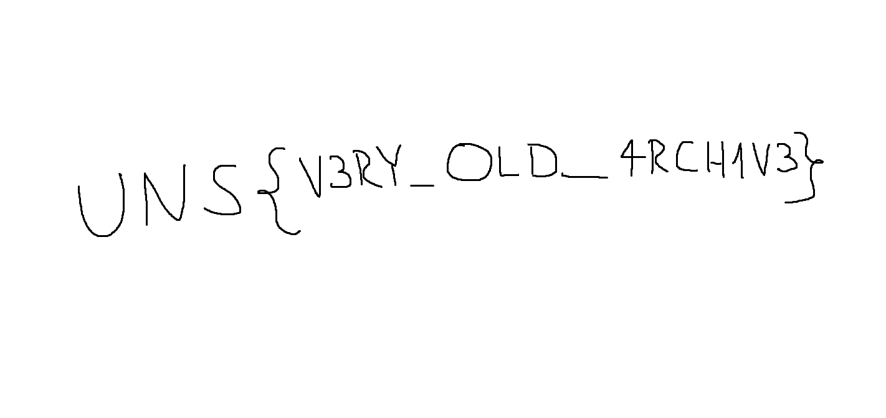

# TryHackMe Writeup – Educational Purposes Only

## Zadatak 4 – Nigerian Prince

Prvo što radimo jeste dekodiranje mejla pomoću alata [spammimic](https://www.spammimic.com/decode.cgi). Ovaj alat omogućava dekodiranje sumnjivih email poruka i otkrivanje skrivenih poruka unutar njih.

Nakon izvršenog dekodiranja teksta email poruke, dobijen je sledeći flag:

**UNS{EM4IL_5P4M_AG4N?}**

*Prikaz rezultata dekodiranja*

---

## Zadatak 5 – Educational Purposes Only

U okviru zadatka pronađen je fajl `forgotten_password.txt` koji je sadržao četiri MD5 heša. Cilj je bio da se pronađu odgovori na postavljena pitanja i dekodiranjem MD5 heševa dobije lozinka za otključavanje ZIP arhive.

Za proveru MD5 vrednosti korišćen je alat [md5hashgenerator](https://www.md5hashgenerator.com/).

Nakon analize arhivskih podataka Fakulteta tehničkih nauka i poređenja sa zadatim heševima, dobijeni su sledeći rezultati:

### 1. Datum kada je Fakultet tehničkih nauka zvanično otvoren
- Odgovor: `18/05/1960`
- MD5: `02c3890bb0b03a24b99c3e4a39f18c44`

### 2. Ime osobe koja je obavljala funkciju dekana (1975–1977)
- Odgovor: `Dragutin`
- MD5: `06904f68128802c069e782b772e85eda`

### 3. Datum kada je pokrenut sajt FTN-a
- Odgovor: `18/05/2005`
- MD5: `f4d7caf81e33bc156cc3e98cf8095d2e`

### 4. Godina uvođenja studija “Poštanski saobraćaj i telekomunikacije”
- Odgovor: `1999`
- MD5: `5ec829debe54b19a5f78d9a65b900a39`

---

Spajanjem svih odgovora redosledom pitanja formirana je lozinka za otključavanje ZIP arhive:
18/05/1960Dragutin18/05/20051999

Nakon otključavanja ZIP arhive pronađena je slika koja sadrži sledeći flag:

**UNS{V3RY_OLD_4RCH1V3}**

