# Sakura Challenge — objedinjeno rešenje

Ovaj dokument sadrži samo delove koji se odnose na **Sakura Challenge**. Izbačeni su ostali zadaci iz dostavljenih fajlova, kao što su OS INT, Pirates of the Memorial, Nigerian Prince, Squid Game Invitation, Educational Purposes Only i Commitment.

> Napomena: screenshotovi su preuzeti iz dostavljenih fajlova i koriste se kao dokumentacija rešavanja CTF/lab zadatka. Zadatak se rešava pasivnim OSINT metodama.

---

## Zadatak 1 — Početak izazova

**Cilj:** potvrditi početak Sakura sobe unosom tražene poruke.

**Koraci:**

1. Otvara se Sakura Room.
2. U uvodnom delu vidi se instrukcija da se u polje za odgovor unese početna poruka.
3. Unosi se poruka prikazana u zadatku.

**Odgovor:**

```text
Let's Go!
```

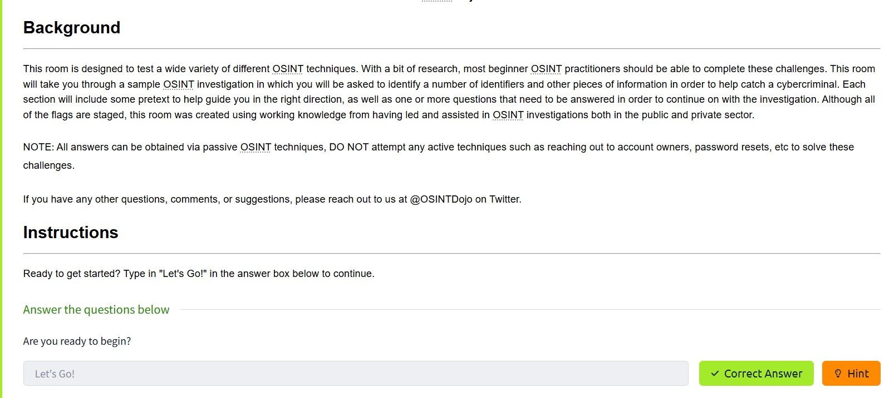

---

## Zadatak 2 — Tip-off / pronalazak korisničkog imena napadača

**Cilj:** pronaći korisničko ime napadača na osnovu slike koju je ostavio.

**Koraci:**

1. Preuzima se slika koju je napadač ostavio.
2. Slika se pregleda ručno i kroz metapodatke / izvor slike.
3. U DevTools prikazu se vidi da se u metapodacima pojavljuje trag koji vodi do korisničkog imena napadača.
4. Kao korisničko ime se izdvaja vrednost `SakuraSnowAngelAiko`.

**Odgovor:**

```text
SakuraSnowAngelAiko
```

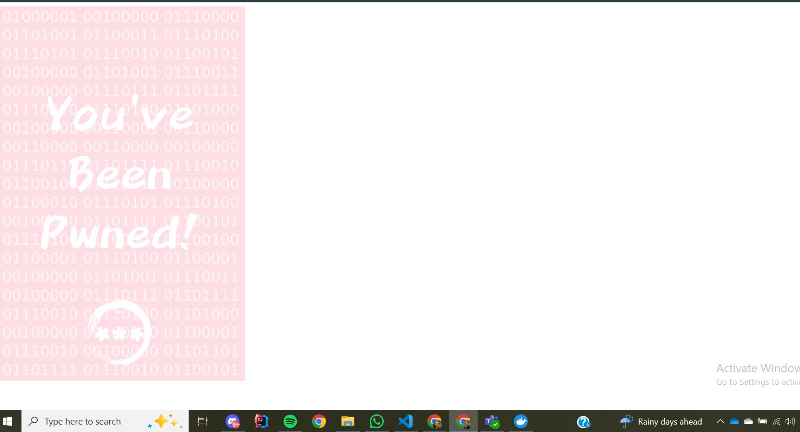

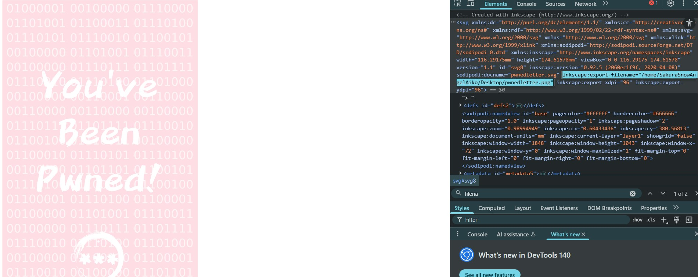

---

## Zadatak 3 — RECONNAISSANCE

**Cilj:** pronaći imejl adresu i puno ime napadača na osnovu korisničkog imena `SakuraSnowAngelAiko`.

### 3.1 Pretraga korisničkog imena

Prvo se proverava gde se korisničko ime pojavljuje na internetu. Za to je korišćen alat **whatsmyname**.

Rezultati pokazuju da nalog postoji na više servisa, uključujući GitHub, TikTok, SourceForge i Udemy.

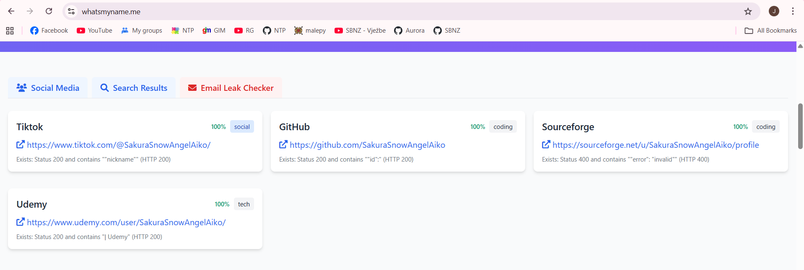

### 3.2 GitHub nalog i PGP repozitorijum

Na GitHub profilu korisnika `SakuraSnowAngelAiko` vidi se više repozitorijuma. Jedan od relevantnih je **PGP**, jer sadrži javni ključ.

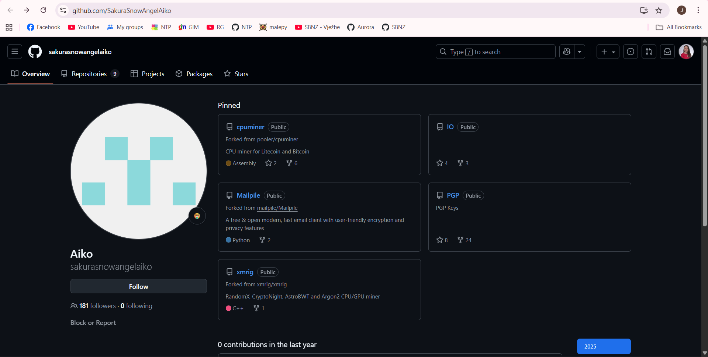

U repozitorijumu **PGP** otvara se fajl `publickey`.

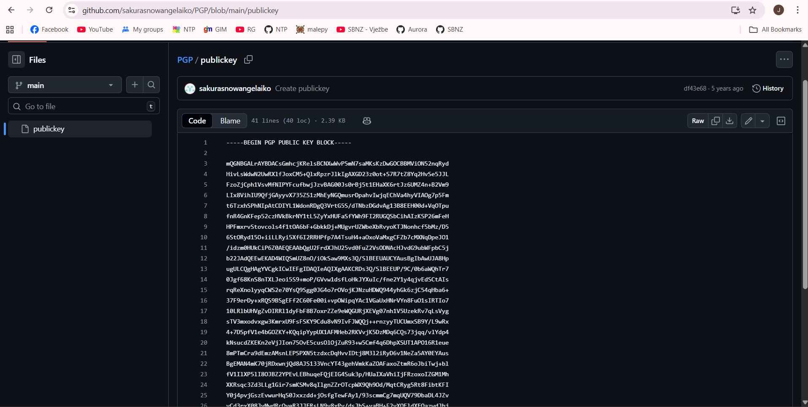

### 3.3 Dekodiranje GPG ključa

Javni ključ se kopira u GPG decoder. U dekodiranom sadržaju se pojavljuje korisnički ID, odnosno imejl adresa napadača.

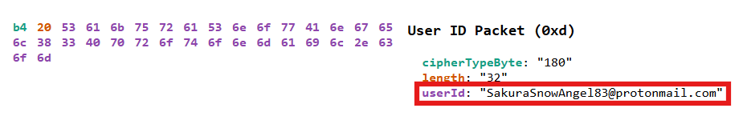

**Odgovor za imejl adresu:**

```text
SakuraSnowAngel83@protonmail.com
```

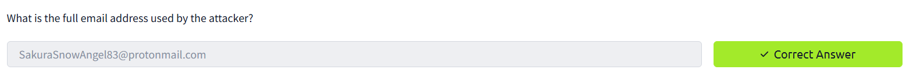

### 3.4 Pronalazak punog imena

Pošto pretraga korisničkog imena preko alata nije bila dovoljna za puno ime, radi se ručna Google pretraga.

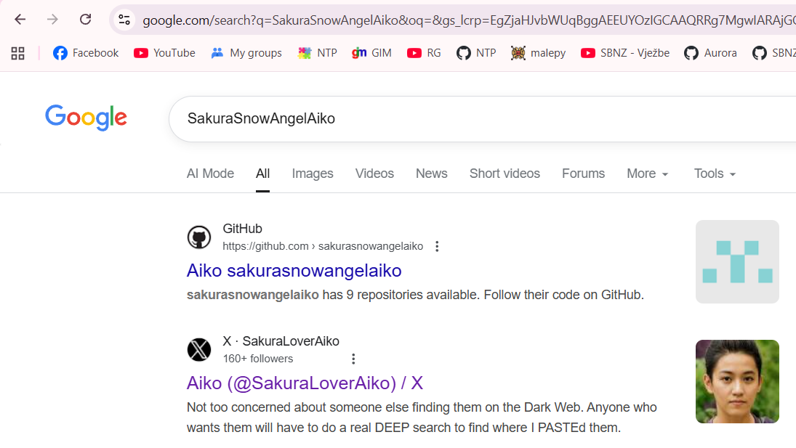

U rezultatima se pojavljuje X/Twitter nalog `@SakuraLoverAiko`. Na tom nalogu meta objavljuje da koristi još jedan nalog: `@AikoAbe3`.

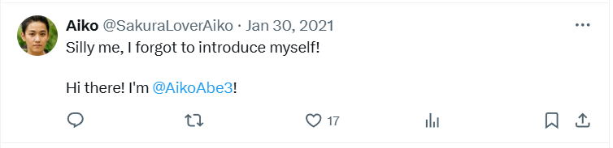

Otvaranjem tog naloga vidi se ime povezano sa profilom.


**Odgovor za puno ime:**

```text
Aiko Abe
```

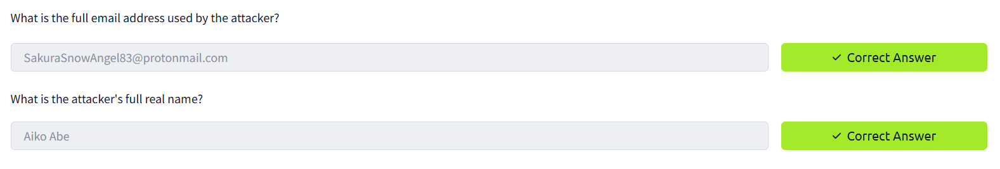

---

## Zadatak 4 — UNVEIL

**Cilj:** pronaći informacije o kripto-novčaniku napadača:

1. za koju kriptovalutu poseduje novčanik,
2. koja je adresa novčanika,
3. od kog mining pool-a je primio uplatu 23. januara 2021. UTC,
4. kojom drugom kriptovalutom je trgovao / koju je razmenjivao.

### 4.1 ETH repozitorijum

Na GitHub profilu se otvaraju repozitorijumi. Relevantan je repozitorijum **ETH**.

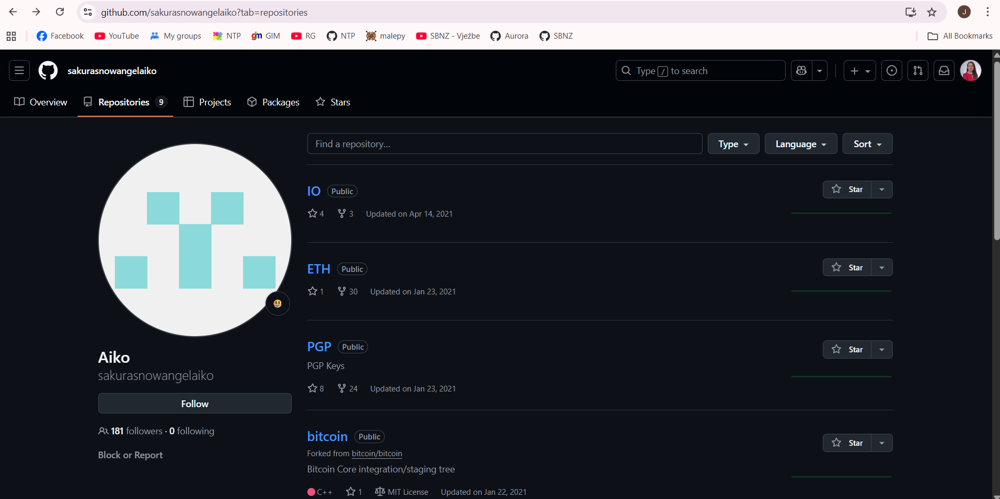

U repozitorijumu **ETH** nalazi se fajl `miningscript`.

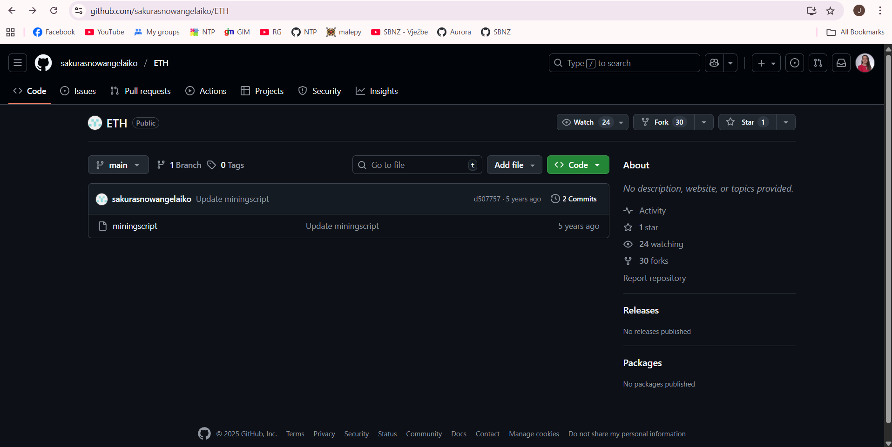

### 4.2 Commit istorija

Pošto postoji više commit-ova, ulazi se u istoriju commit-ova i proverava se starija verzija fajla.

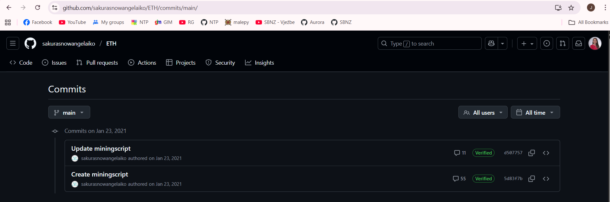

U početnom commit-u vidi se `stratum` link koji sadrži Ethereum adresu.

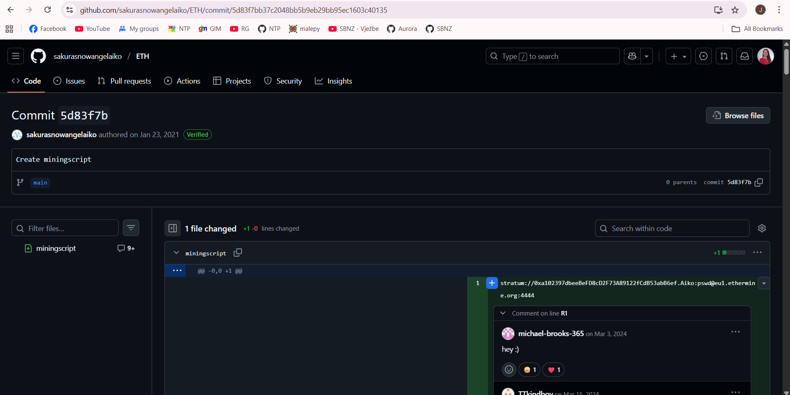

### 4.3 Kriptovaluta

Pretragom pronađene adrese vidi se da je u pitanju **Ethereum** novčanik.

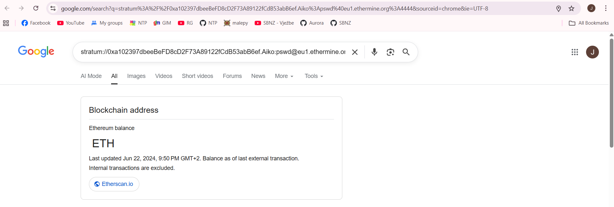

**Odgovor:**

```text
Ethereum
```

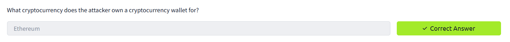

### 4.4 Adresa novčanika

Otvaranjem blockchain explorer-a vidi se adresa novčanika u URL-u.

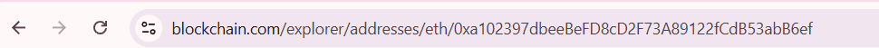

**Odgovor:**

```text
0xa102397dbeeBeFD8cD2F73A89122fCdB53abB6ef
```

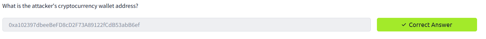

### 4.5 Mining pool

Pregledom istorije transakcija traži se dolazna transakcija od **23. januara 2021. UTC**. Kod te transakcije se vidi da je uplata došla od **Ethermine**.

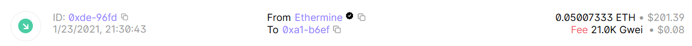

**Odgovor:**

```text
Ethermine
```

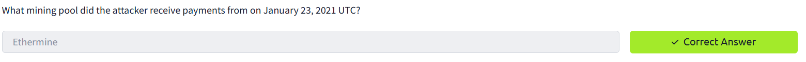

### 4.6 Druga kriptovaluta

Pregledom transakcija vidi se da je napadač više puta vršio konverzije iz ETH u **Tether USDT**.

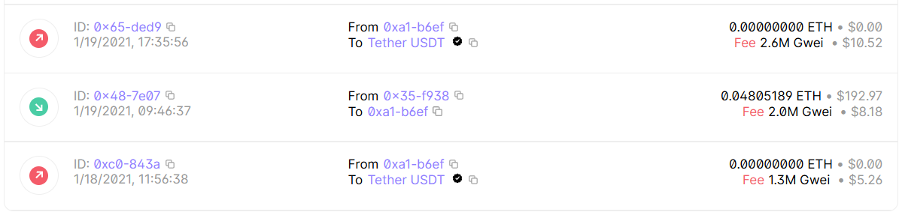

**Odgovor:**

```text
Tether
```

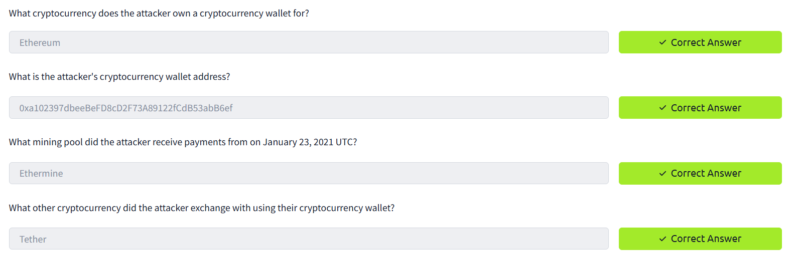

---

## Zadatak 5 — TAUNT

**Cilj:** pronaći trenutni Twitter/X nalog napadača, paste URL sa WiFi podacima i BSSID kućnog WiFi-ja.

### 5.1 Trenutni Twitter/X nalog

Iz ranijih koraka imamo stari nalog `@AikoAbe3`. Pretragom tog imena i pregledom objava dolazi se do novog naloga.

**Odgovor:**

```text
@SakuraLoverAiko
```

### 5.2 Paste lokacija za WiFi SSID-ove i lozinke

Na Twitter/X nalogu se vidi objava u kojoj meta kaže da je prethodni paste uklonjen i da je dodala novi. Screenshot prikazuje DeepPaste rezultat za listu WiFi mreža i lozinki.

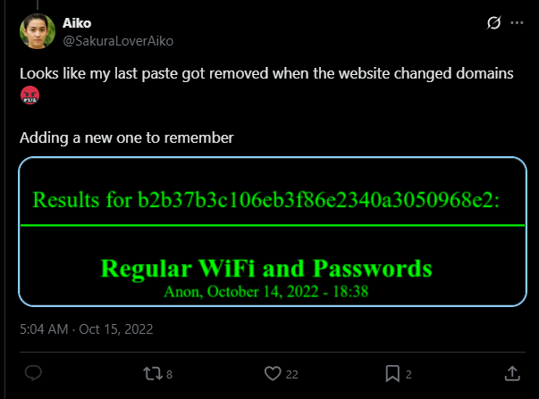

URL je defangovan da ne bude direktno klikabilan:

```text
http[:]//depasteon6cqgrykzrgya52xglohg5ovyuyhte3ll7hzix7h5ldfqsyd.onion/show.php?md5=0a5c6e136a98a60b8a21643ce8c15a74
```

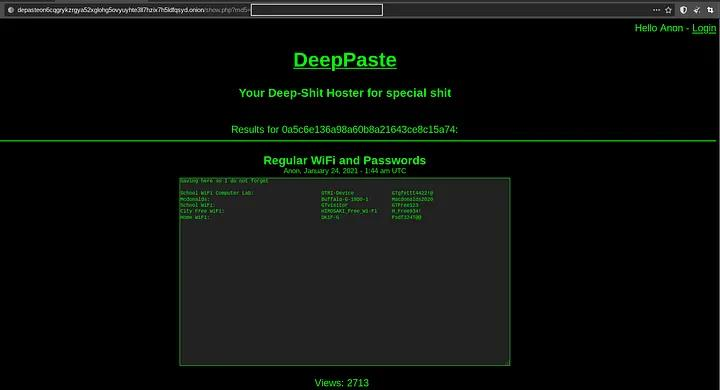

### 5.3 BSSID kućnog WiFi-ja

Iz liste se koristi SSID **Home Wifi**. Pretragom tog SSID-a u WiGLE bazi dobija se BSSID.

**Odgovor:**

```text
84:af:ec:34:fc:f8
```

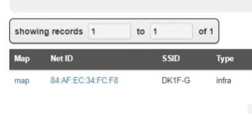

---

## Zadatak 6 — HOMEBOUND

**Cilj:** rekonstruisati rutu napadača i pronaći aerodrome, jezero i grad koji verovatno smatra domom.

### 6.1 Najbliži aerodrom lokaciji fotografije

Na Twitter/X nalogu nalazi se fotografija trešnjinog cveta. Na slici se vidi prepoznatljiv obelisk. Reverse image search vodi do **Washington Monument**, koji se nalazi u National Mall-u u Vašingtonu.

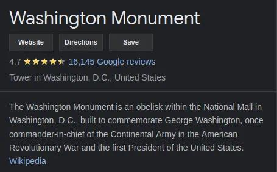

Najbliži aerodrom toj lokaciji je **Ronald Reagan Washington National Airport**.

**Odgovor:**

```text
Ronald Reagan Washington National Airport / DCA
```


### 6.2 Poslednje presedanje

Na sledećoj objavi vidi se lounge fotografija. Reverse image search pokazuje da je u pitanju JAL Sakura Lounge na aerodromu Tokyo Haneda.

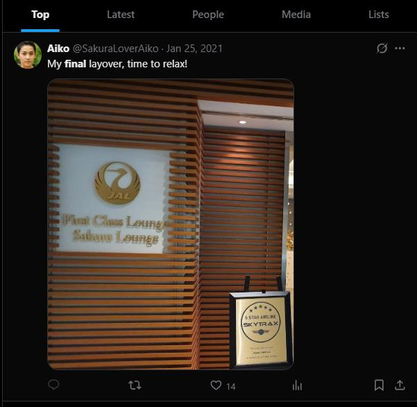

**Odgovor:**

```text
HND
```


### 6.3 Jezero sa mape poslednjeg leta

Na slici mape leta vidi se deo Japana. Upoređivanjem sa Google Maps prikazom identifikuje se jezero.

**Odgovor:**

```text
Lake Inawashiro
```

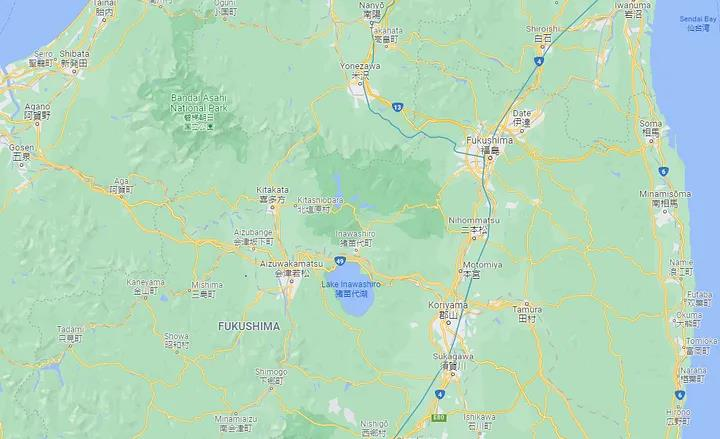

### 6.4 Grad koji meta verovatno smatra domom

Na osnovu pravca leta i WiGLE lokacije za kućni WiFi, grad koji se uklapa sa tragovima je **Hirosaki**.

**Odgovor:**

```text
Hirosaki
```

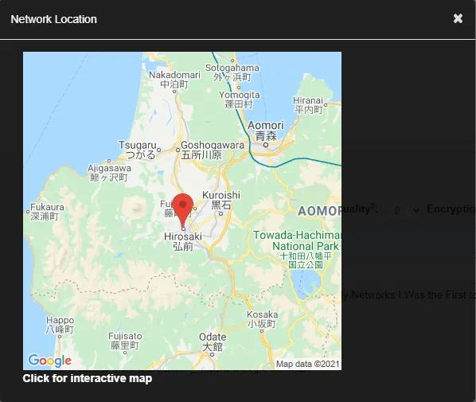

Dodatni trag iz objave sa trešnjinim cvetom:

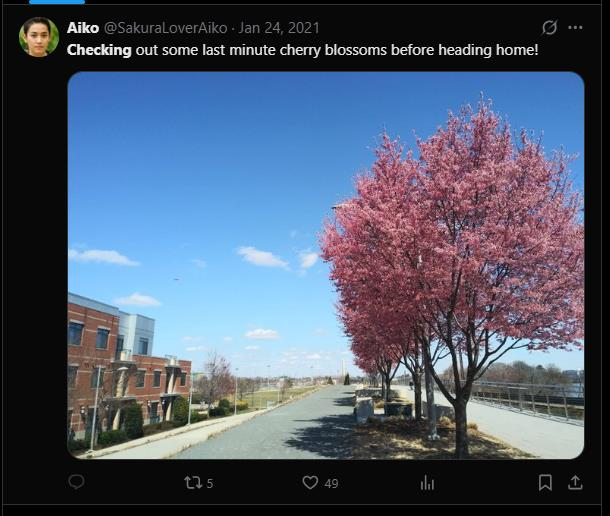

---

## Sažetak odgovora

| Zadatak | Pitanje / cilj | Odgovor |
|---|---|---|
| 1 | Početna poruka | `Let's Go!` |
| 2 | Korisničko ime napadača | `SakuraSnowAngelAiko` |
| 3 | Imejl adresa | `SakuraSnowAngel83@protonmail.com` |
| 3 | Puno ime | `Aiko Abe` |
| 4 | Kriptovaluta novčanika | `Ethereum` |
| 4 | Adresa novčanika | `0xa102397dbeeBeFD8cD2F73A89122fCdB53abB6ef` |
| 4 | Mining pool | `Ethermine` |
| 4 | Druga kriptovaluta | `Tether` |
| 5 | Trenutni Twitter/X nalog | `@SakuraLoverAiko` |
| 5 | Paste URL | `http[:]//depasteon6cqgrykzrgya52xglohg5ovyuyhte3ll7hzix7h5ldfqsyd.onion/show.php?md5=0a5c6e136a98a60b8a21643ce8c15a74` |
| 5 | BSSID kućnog WiFi-ja | `84:af:ec:34:fc:f8` |
| 6 | Najbliži aerodrom | `Ronald Reagan Washington National Airport / DCA` |
| 6 | Poslednje presedanje | `HND` |
| 6 | Jezero | `Lake Inawashiro` |
| 6 | Grad / home city | `Hirosaki` |
